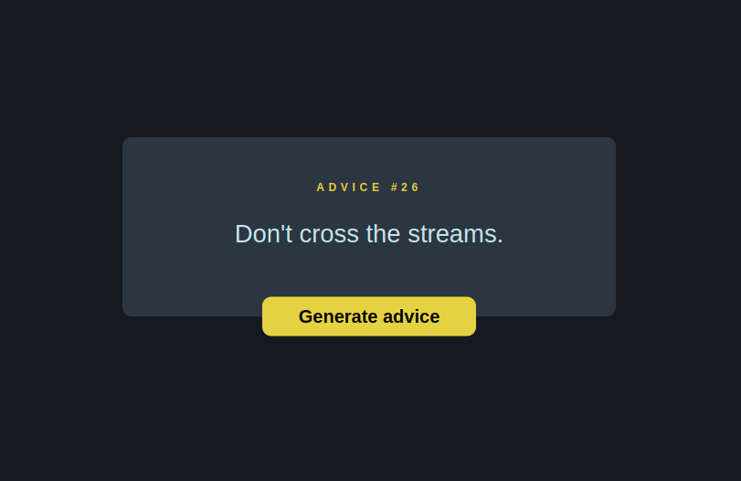

#  Advice Generator 

Create a project that will call the api and generate a advice every time 
user press a button. 

**Style guide :** 

**Colors :**

Yellow color : **#e0d500**

font-family : **Roboto**

box-color : **hsla(217, 19%, 38%, 0.4)**

dark-blue-color : **hsl(222, 18%, 11%)**

API : (https://api.adviceslip.com)

